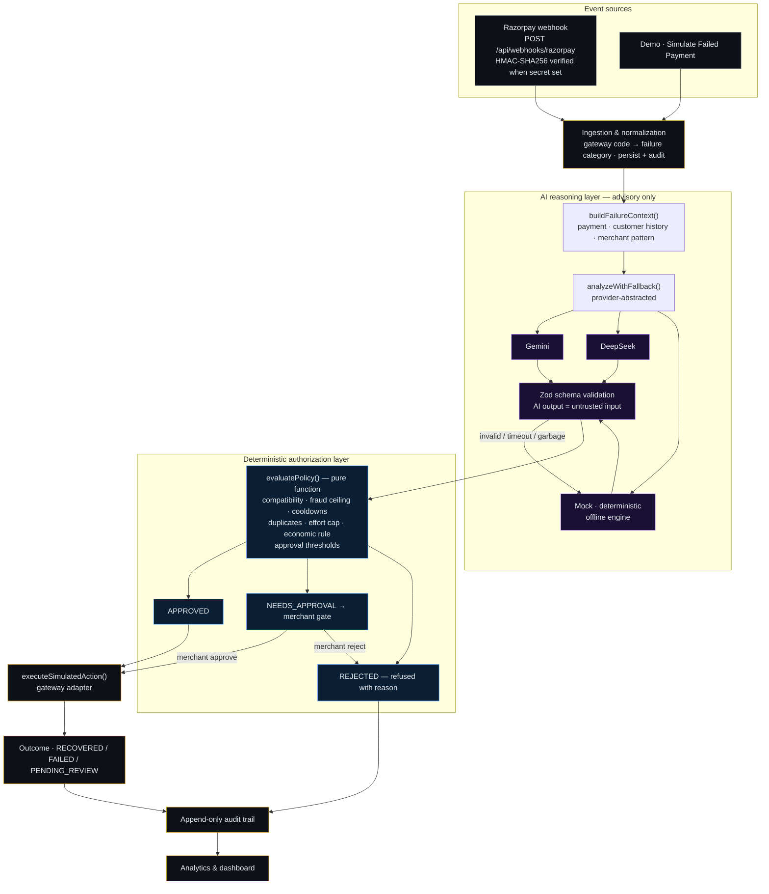

# RecoverAI

> **Turn failed payments into recovered revenue — without letting an AI touch money on its own.**

**AI recommends. Application rules authorize. Humans approve when it matters.**

**[Live demo →](https://recoverai-v90c.onrender.com/)** · **[GitHub repository →](https://github.com/BinarySpecter/RecoverAI)**

RecoverAI is an **AI revenue recovery command center**. Every failed payment is diagnosed by an AI,
checked by a deterministic policy engine, and — when the risk or value is high enough — held for a
human decision. Nothing an AI says can move money on its own, and every rupee of recovery is
measured and audited on the dashboard.

```
PAYMENT FAILURE → AI DIAGNOSIS → POLICY VALIDATION → RECOVERY ACTION → OUTCOME → AUDIT TRAIL → ANALYTICS
```

---

## The 30-second pitch

| Judge asks | RecoverAI's answer |
|---|---|
| **What** | AI-powered recovery for failed payments — the revenue merchants are about to lose. |
| **Why now** | "Card declined" is usually a dead-end status, but most failures are recoverable: soft issuer declines, insufficient funds at the wrong moment, expired saved cards, network blips, abandoned checkouts. |
| **How** | The AI diagnoses *why* a payment failed and recommends one action from a bounded catalog → a deterministic policy engine independently decides whether that action may run. |
| **Why it's safe** | The LLM is **never on the authorization path**. It cannot charge, email, or escalate — it can only recommend, and a recommendation that fails policy is stopped with a reason. High-value and high-risk actions are held for merchant approval. |

---

## What is RecoverAI?

Failed payments are a silent tax on every merchant. The obvious fix — turn an AI agent loose to retry
charges, message customers, and switch payment methods — is unsafe: a hallucinated action on real
payment rails means charging the wrong customer, spamming fraud victims, or retrying into a decline
spiral.

RecoverAI splits the problem in two:

- **AI does the reasoning.** A provider-abstracted AI (deterministic offline engine, Gemini, or
  DeepSeek) diagnoses *why* the payment failed, explains its reasoning, and recommends **one action
  from a fixed catalog of eight** — as structured, schema-validated JSON.
- **Application rules do the authorizing.** A deterministic policy engine — not the LLM — evaluates
  the recommendation against hard rules: payment state, category/action physics, cooldowns, amount
  thresholds, fraud ceilings, duplicate suppression, an effort cap, and an economic stopping rule.
  Same inputs, same verdict, every time.

Who decides what:

| Layer | Decides | Cannot do |
|---|---|---|
| **AI** | Diagnosis, root cause, recommended action, confidence | Execute, authorize, invent actions, contact fraud-flagged customers |
| **Policy engine** | Whether a recommendation may run (approve / reject / gate) | Be talked around by LLM output — it is a pure function of `(request, history)` |
| **Merchant** | Approve or reject high-value / high-risk actions | — |
| **Audit trail** | Nothing — it *records* everything | Be rewritten (append-only) |

---

## Product

The hosted demo (or `npm run dev` locally) is the real product. Every number is computed from the
database — nothing is mocked in the UI. The strongest screens:

**Overview** — the financial state of the operation for the demo merchant (TechNova Commerce):
revenue at risk, recovered in the last 30 days, and incremental recovery vs. a do-nothing baseline.
A live operational strip counts active opportunities, actions awaiting approval, and actions refused
by policy; below it sit the 7-day trend, recovery rate by failure type, the guardrails currently in
force, and a live feed of recent decisions.

**Recovery (work queue)** — every open failed payment as a row: customer, amount, AI diagnosis,
confidence, recommended action, policy decision, and status. Gated cases can be approved or rejected
inline; every row links to its full case file.

**Payment Detail (case file)** — one payment told top to bottom as a numbered narrative:
`01 Failure → 02 Diagnosis → 03 AI recommendation → 04 Policy decision → 05 Execution → 06 Outcome`,
with the expected-recovery economics of each decided action. Beside it: the payment record, the
customer signals the AI weighed, raw gateway attempts — and the complete chronological audit trail.

**Approvals** — the human-in-the-loop gate. Every case shows what failed, how much is gated, why
policy requires sign-off, and the economics of approving (expected recovery vs. action cost). Nothing
executes until the merchant decides; every decision is audited.

**Recovery Lab** — offline counterfactual evaluation. One seeded world of 500 failures is replayed
through four strategies — do nothing, blind retry, generic dunning, and RecoverAI — to measure what
each would have recovered. It shows **where** the AI adds value and **where** it turns money down on
purpose. Writes nothing to the database.

**Activity & Audit** — the append-only log of every decision, attributed to an actor
(`AI:<provider>`, `POLICY`, `GATEWAY`, `MERCHANT`, or `SYSTEM`), filterable by level, with the payload
of each step expandable.

**Safety Model** — the two-layer authorization architecture rendered as a diagram, the active AI
engine and provider, live counts of why actions were refused in the last 7 days, and the complete
bounded action catalog with each action's risk, cooldown, approval threshold, cost, and efficacy. The
safety claims are inspectable, not marketing.

> The screenshots in this README are intentionally described, not embedded: the fastest way to see the
> product is the **[live demo](https://recoverai-v90c.onrender.com/)** — or two commands locally
> (`npm install && npm run setup && npm run dev`).

---

## Architecture

The system is a pipeline of small, single-purpose modules. The AI produces an advisory diagnosis;
the deterministic policy engine is the only thing that authorizes; execution touches the gateway
through an adapter.



Key properties of the real implementation:

- **One ingestion funnel.** Failures arrive from the demo simulator, the seed, or (in production) the
  Razorpay webhook route — all normalize through the same `ingestFailure()` path.
- **AI is on a side branch, not the critical path.** `analyzeWithFallback()` returns a validated
  diagnosis; from that point the pipeline is plain, deterministic application code.
- **The policy engine is a pure function.** `evaluatePolicy()` has no I/O and cannot be influenced by
  prompt output — it can only be given an action and asked for a verdict.
- **Per-payment serialization.** A dedup lock guarantees one pipeline in flight per payment, so
  duplicate webhook deliveries or double-clicks never create stacked actions.
- **SQLite → PostgreSQL is a config change.** The Prisma schema is portable by construction.

`ARCHITECTURE.md` documents the full system and data model; `AI.md` covers prompts, the output
schema, and fallback behavior.

---

## Safety model

Two layers with one hard boundary.

**Layer 1 — AI reasoning (advisory).** The AI sees the failure, customer history, and the merchant's
own recovery patterns, and returns a single schema-validated diagnosis with one recommended action
from the eight-action catalog. Its output is treated as **untrusted input**: malformed JSON,
invented actions, and out-of-range values are rejected by Zod and replaced by the deterministic
offline engine — marked `usedFallback` and audited at `warn` level, never silent.

**Layer 2 — deterministic policy (authorization).** Application code independently evaluates the
recommendation before anything runs:

- **Compatibility** — hard banned combinations (an expired card is never blindly retried; a fraud
  signal never triggers a charge or a message).
- **Fraud ceiling** — no automated customer contact above a 0.8 risk score; the case escalates.
- **Amount gates** — retries at/above **₹50,000** and customer-messaging at/above **₹1,00,000**
  require merchant approval before execution.
- **Cooldowns & duplicates** — per-action cooldowns (1–24h) and duplicate suppression stop
  harassment; an effort cap of 4 actions per payment stops endless retrying.
- **Economic stopping rule** — an action whose expected recovery value (deterministic catalog
  efficacy × amount) does not exceed its action cost is refused outright.

> **The LLM never directly executes a financial action.** It cannot charge, email, escalate, or
> override policy. It can only recommend — and a recommendation that fails policy is stopped with a
> recorded reason. Money movement happens only after a deterministic verdict, and for high-value or
> high-risk cases, only after an explicit human decision.

| AI **can** | AI **cannot** |
|---|---|
| Diagnose the failure and its root cause | Authorize or execute money movement |
| Recommend an action from the bounded catalog | Bypass, override, or mint policy |
| Explain its reasoning in plain language | Contact a fraud-flagged customer |
| Estimate recovery probability (advisory) | Ignore the economic stopping rule |

---

## Demo scenarios

Open the live demo and run these — each is one click from the Overview:

1. **Temporary decline → automatic recovery.** Run the default **₹12,499 card decline**. The AI
   diagnoses *temporary decline* → recommends a **scheduled delayed retry** → policy approves
   (eligible — under the ₹50,000 approval threshold) → the retry executes → **₹12,499 recovered**,
   every step audited.
2. **High-value payment → human approval.** Simulate a **₹75,000+** failure (or open the preseeded
   **₹1,24,999** high-value case). Policy returns `NEEDS_APPROVAL` — above the ₹50,000 retry
   threshold — and **nothing executes until you approve it** from the queue. Approve and watch the
   audit trail record the merchant decision before execution.
3. **Fraud risk → escalation.** Open the preseeded **gift-card fraud** case for **Mohit Bhandari**
   (risk score 0.85). The AI escalates and policy **blocks every customer-facing action** — no
   automated contact, no re-charge — and the case is routed to the merchant.

A 5-minute walkthrough of these is in [`DEMO_SCRIPT.md`](DEMO_SCRIPT.md).

---

## Technical stack

| Layer | Choice | Why |
|---|---|---|
| App | **Next.js (App Router) + React + TypeScript** | One repo, one deploy; server-side rendering for dashboards |
| Styling | **Tailwind CSS** | The premium fintech command center UI, dark + light themes |
| Database | **Prisma + SQLite** | Zero-setup for judges; PostgreSQL is a one-line swap |
| Validation | **Zod** | API input **and** AI output validation (AI = untrusted input) |
| AI | **Provider abstraction** | `MockProvider` (deterministic offline engine) · Gemini · DeepSeek, with timeout/garbage/schema fallback |
| Policy | **Pure-function engine** (`policy-engine.ts`) | Deterministic, fully unit-tested authorization |
| Money | **Integer paise end to end** | No floats anywhere in the money path |
| Gateway | **Adapter** (`payment-gateway.ts`) | Deterministic simulated outcomes; Razorpay webhook route included |
| Tests | **Vitest** | 71 tests, TS-native |

---

## Real vs simulated

Stated plainly, for judge trust:

| Real — works in this repo | Simulated for the hackathon |
|---|---|
| Failure ingestion, normalization, policy engine, approval gates, action lifecycle, cooldowns, economic stopping rule | Gateway charge outcomes (deterministic, seeded per payment) |
| AI diagnosis via the provider abstraction — offline engine, Gemini, or DeepSeek | Customer responses to links/reminders (probability roll) |
| Append-only audit trail and analytics derived entirely from the database | Demo customer and payment data (synthetic seed) |
| Webhook route with **HMAC-SHA256 signature verification** (enforced when `RAZORPAY_WEBHOOK_SECRET` is set) and duplicate-delivery tolerance | Razorpay *account* events — no real gateway is connected |
| The hosted demo runs the full pipeline on the offline-safe engine | All money movement — represented as paise in SQLite |

**No real money was recovered in this demo.** The gateway boundary is where a production integration
would connect; webhook signature verification is implemented and documented at
`src/app/api/webhooks/razorpay/route.ts`.

---

## Quick start

```bash
npm install     # dependencies
npm run setup   # migrate + deterministic seed (creates prisma/dev.db)
npm run dev     # dev server at http://localhost:3000
```

The demo runs **without any API keys** — the deterministic offline-safe engine handles diagnosis. To
use a real provider: copy `.env.example` → `.env`, set `AI_PROVIDER=gemini|deepseek` and the key.

| Command | What it does |
|---|---|
| `npm run dev` | Dev server at :3000 |
| `npm run setup` | Migrate + seed deterministic demo data |
| `npm run db:reset` | Drop, migrate, reseed (reproducible) |
| `npm run db:seed` | Reseed only |
| `npm test` | Vitest suite (**71 tests**) |
| `npm run typecheck` / `npm run lint` | TypeScript / ESLint |
| `npm run build && npm start` | Production build + serve |

---

## Testing

**71 tests** (`npm test`) covering: failure ingestion and validation; AI structured-output parsing;
provider fallback (timeout, garbage, schema-invalid, HTTP errors); every policy rule in isolation —
including the fraud ceiling, effort cap, duplicate suppression, and the economic stopping rule; the
high-value approval gate and merchant reject path; the full pipeline end-to-end; the webhook's
HMAC-SHA256 signature verification; per-payment concurrency/dedup behavior; and analytics math.

---

## Documentation

| Doc | Contents |
|---|---|
| [`ARCHITECTURE.md`](ARCHITECTURE.md) | System design and data model |
| [`AI.md`](AI.md) | Prompts, schema, provider fallback |
| [`DEMO.md`](DEMO.md) | Demo runs, API examples |
| [`DEMO_SCRIPT.md`](DEMO_SCRIPT.md) | 5-minute demo walkthrough |
| [`DECISIONS.md`](DECISIONS.md) | Trade-offs and why |
| [`JUDGING.md`](JUDGING.md) | Track criteria mapping |
| [`HANDOFF.md`](HANDOFF.md) | Handoff notes |

---

## Why this matters

RecoverAI is not trying to replace payment infrastructure with an autonomous agent. It puts AI where
it is genuinely useful — diagnosing failures and recommending the next move — and keeps authorization
deterministic, bounded, and auditable. That is the version of "AI revenue recovery" a merchant can
actually say yes to: every action explainable after the fact, every high-stakes decision held for a
human, and every rupee of recovery measurable on the dashboard.
